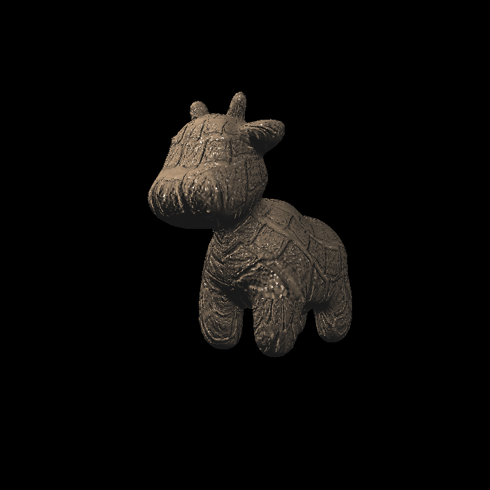
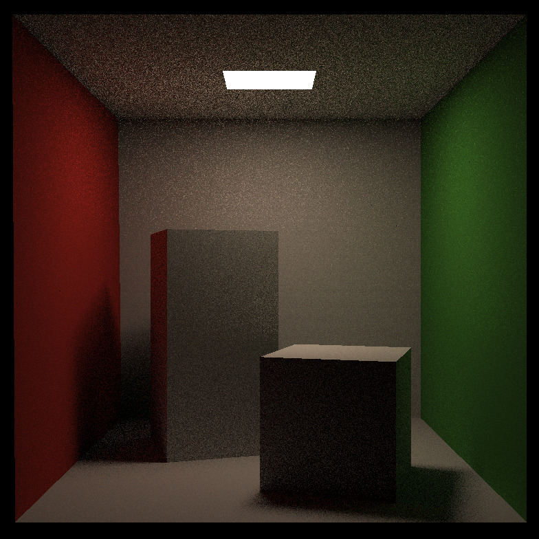
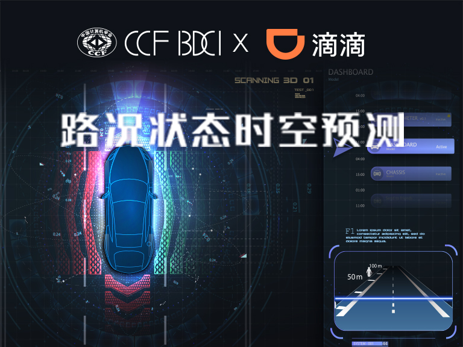

## About Me
I am a Ph.D. student at the Department of Automation, Tsinghua University. Before I start my Ph.D. journey, I received my Master's degree at the Institution for Interdisciplinary Information Science (IIIS), Tsinghua University. My advisor is Chenye Wu, who is advised by Andrew Chi-Chih Yao. Before entering IIIS, I am a bachelor in the Department of Thermal Engineering. 

My research interests are physical simulation (especially fluid) and animation. I hope to make a fast simulator with larger geometry flexibility for both robotics and inverse design. Indeed, I am still active in stochastic analysis and different privacy. Welcome for communication if you are interested in my work on these topics!

  
## Selection Publication
<table style="width:100%; border: none;">
   <tr>
    <th style="border-bottom: 0;color: #595959;font: 16.0px/1.5 Crimson Pro, serif;">

</th>
    <th style="border-bottom: 0;color: #595959;font: 16.0px/1.5 Crimson Pro, serif;"><ul><li>
<strong>Physical simluation for plasma ignition</strong> Use OpenFOAM to conduct the simluation for plasma ignition. Constrcut a simple framework to simulation this phenomenon and try to find the insights for engineering. [<a href="https://github.com/qingxu-thu/plasma_ignite">code</a>]
</li></ul></th>
  </tr>
   <tr>
     <th style="border-bottom: 0;">  </th>
    <th style="border-bottom: 0;"><h3 style="text-align: center"><a href="https://github.com/qingxu-thu/Games-101-HW">Homework for Games 101</a></h3></th>
  </tr>  
  <tr>
    <th style="border-bottom: 0;color: #595959;font: 16.0px/1.5 Crimson Pro, serif;">

</th>
    <th style="border-bottom: 0;color: #595959;font: 16.0px/1.5 Crimson Pro, serif;"><ul><li>
<strong>Normal mapping and Displacement mapping</strong> Conduct basic texture mapping and normal mapping with simple soft rendering pipeline. [<a href="https://github.com/qingxu-thu/Games-101-HW/tree/main/Assignment3">code</a>]
</li></ul></th>
  </tr>
  <tr>
    <th style="border-bottom: 0;color: #595959;font: 16.0px/1.5 Crimson Pro, serif;">

</th>
    <th style="border-bottom: 0;color: #595959;font: 16.0px/1.5 Crimson Pro, serif;"><ul><li>
<strong>Whitted-Style Ray tracing</strong> Conduct ray tracing with BVH acceleration for simple CornellBox. [<a href="https://github.com/qingxu-thu/Games-101-HW/tree/main/PA7-1/PA7">code</a>]
</li></ul></th>
  </tr>
   <tr>
     <th style="border-bottom: 0;">  </th>
    <th style="border-bottom: 0;"><h3 style="text-align: center"><a href="https://github.com/qingxu-thu/Games-202-HW">Homework for Games 202</a></h3></th>
  </tr>  
  <tr>
    <th style="border-bottom: 0;color: #595959;font: 16.0px/1.5 Crimson Pro, serif;">

</th>
    <th style="border-bottom: 0;color: #595959;font: 16.0px/1.5 Crimson Pro, serir;"><ul><li>
<strong>PCF and PCSS for soft shadow</strong> Conduct PCF and PCSS compared with simple two pass shadow map and derive some sights for soft shadow. [<a href="https://github.com/qingxu-thu/Games-202-HW/tree/main/hw1">code</a>]
</li></ul></th>
  </tr>
  <tr>
    <th style="border-bottom: 0;color: #595959;font: 16.0px/1.5 Crimson Pro, serif;">

</th>
    <th style="border-bottom: 0;color: #595959;font: 16.0px/1.5 Crimson Pro, serif;"><ul><li>
<strong>Precomputed Radiance Transfer</strong> Conduct PCF and PCSS compared with simple two pass shadow map and derive some sights for soft shadow. [<a href="https://github.com/qingxu-thu/Games-202-HW/tree/main/assignment2">code</a>]
</li></ul></th>
  </tr>
  <tr>
    <th style="border-bottom: 0;color: #595959;font: 16.0px/1.5 Crimson Pro, serif;">

</th>
    <th style="border-bottom: 0;color: #595959;font: 16.0px/1.5 Crimson Pro, serif;"><ul><li>
<strong>CCF&DIDI time and spatial prediction</strong> Predict the roads' degree of crowdedness with the history time data and the spatial data of the road. We got the rank 13 for 200 competitors. [<a href="https://github.com/qingxu-thu/competition-preprocess-code">code</a>]
</li></ul></th>
 </tr>
</table>

## Academic Service
- Reviewer for Neruips 2022 and ICLM 2023
- TA for Basic of Artificial Intelligence in Tsinghua University
