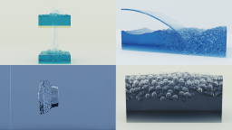
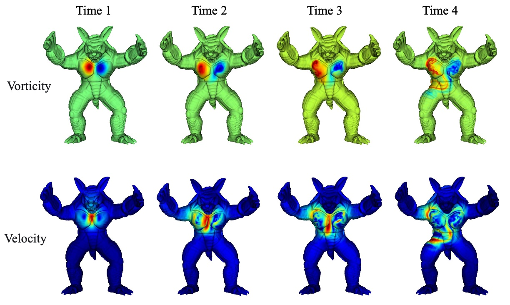
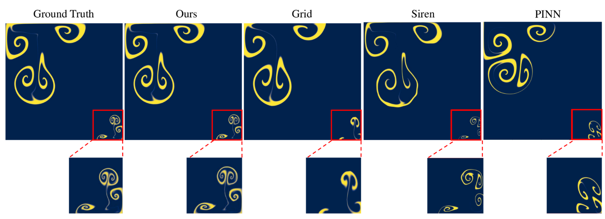
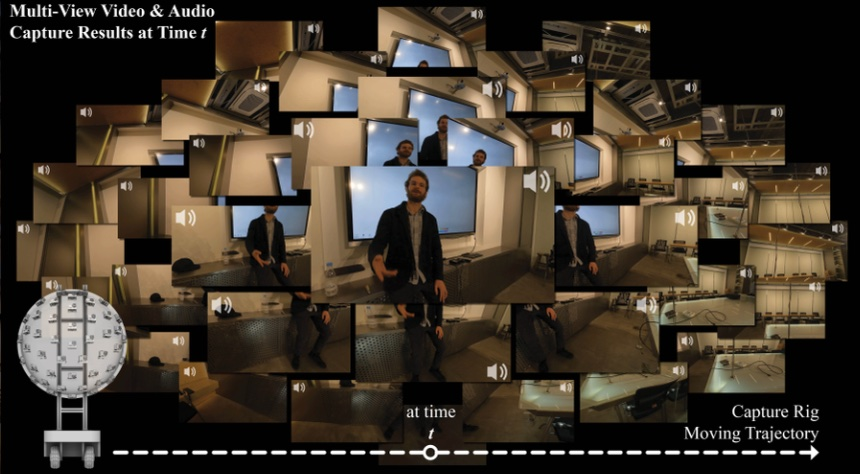

## About Me
I am a Ph.D. student at the Department of Automation, Tsinghua University. Before I start my Ph.D. journey, I received my Master's degree at the Institution for Interdisciplinary Information Science (IIIS), Tsinghua University. My advisor is Chenye Wu, who is advised by Andrew Chi-Chih Yao. Before entering IIIS, I am a bachelor in the Department of Thermal Engineering. 

My research interests are physical simulation (especially fluid) and animation. I hope to make a fast simulator with larger geometry flexibility for both robotics and inverse design. Indeed, I am still active in stochastic analysis and different privacy. Welcome for communication if you are interested in my work on these topics!

  
## Selected Publications
<table style="width:100%; border: none;">
   <tr>
    <th style="border-bottom: 0;color: #595959;font: 16.0px/1.5 Crimson Pro, serif;">

</th>
    <th style="border-bottom: 0;color: #595959;font: 16.0px/1.5 Crimson Pro, serif;"><ul><li>
<strong>Kinetic Free-Surface Flows and Foams with sharp Interfaces</strong> 
    <strong>Haoxiang Wang</strong>, Kui Wu, Hui Qiao, Mattieu Desbrun, Wei Li 
    ACM Transactions on Graphics (SIGGRAPH Asia 2025) 
    <em>Journal Track, accepted</em>
    [<a href="./assets/WWQD25.pdf" target="_blank">Paper</a>][<a href="./assets/Final2.mp4" target="_blank">Video</a>]
    
</li></ul></th>
  </tr>
  <tr>
    <th style="border-bottom: 0;color: #595959;font: 16.0px/1.5 Crimson Pro, serif;">

</th>
    <th style="border-bottom: 0;color: #595959;font: 16.0px/1.5 Crimson Pro, serif;"><ul><li>
<strong>Neural Fluid Simulation on Geometric Surfaces</strong> 
    <strong>Haoxiang Wang</strong>, Tao Yu, Hui Qiao, Qionghai Dai 
    International Conference on Learning Representations (ICLR 2025) 
    [<a href="https://openreview.net/forum?id=58lbAsXCoZ" target="_blank">Paper</a>]
</li></ul></th>
  </tr>
  <tr>
    <th style="border-bottom: 0;color: #595959;font: 16.0px/1.5 Crimson Pro, serif;">

</th>
    <th style="border-bottom: 0;color: #595959;font: 16.0px/1.5 Crimson Pro, serif;"><ul><li>
<strong>Neural physical simulation with multi-resolution hash grid encoding</strong> 
    <strong>Haoxiang Wang</strong>, Tao Yu, Tianwei Yang, Hui Qiao, Qionghai Dai 
    Annual AAAI Conference on Artificial Intelligence (AAAI 2024)  <em>Oral</em>
    [<a href="https://ojs.aaai.org/index.php/AAAI/article/view/28349/28684" target="_blank">Paper</a>] [<a href="https://underline.io/lecture/92723-neural-physical-simulation-with-multi-resolution-hash-grid-encoding" target="_blank">Talk</a>]
</li></ul></th>
  </tr>
  <tr>
    <th style="border-bottom: 0;color: #595959;font: 16.0px/1.5 Crimson Pro, serif;">

</th>
    <th style="border-bottom: 0;color: #595959;font: 16.0px/1.5 Crimson Pro, serif;"><ul><li>
<strong>ImViD: Immersive Volumetric Videos for Enhanced VR Engagement</strong> 
    Zhengxian Yang, Shi Pan, Shengqi Wang, <strong>Haoxiang Wang</strong>, Li Lin, Guanjun Li, Zhengqi Wen, Borong Lin, Jianhua Tao, Tao Yu 
    The IEEE/CVF Conference on Computer Vision and Pattern Recognition 2025 (CVPR 2025) <em>Hignlight</em>
    [<a href="https://arxiv.org/pdf/2503.14359" target="_blank">Paper</a>] [<a href="https://yzxqh.github.io/ImViD/" target="_blank">Project Page</a>]
</li></ul></th>
  </tr>
</table>

